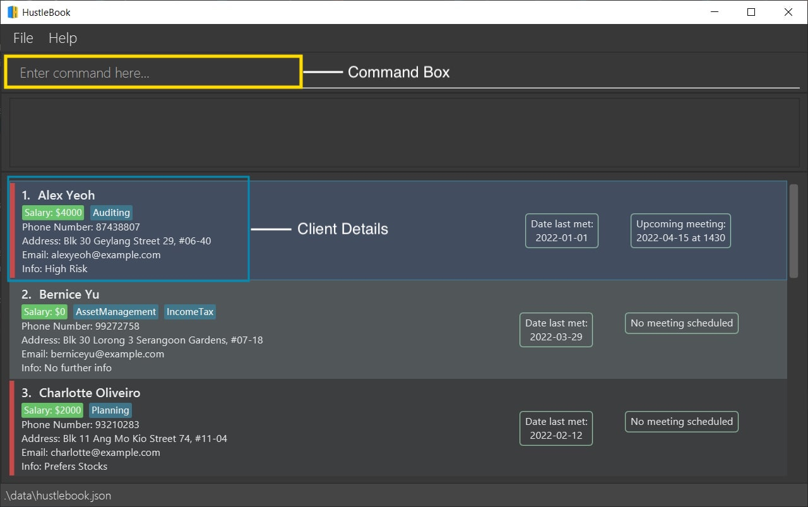
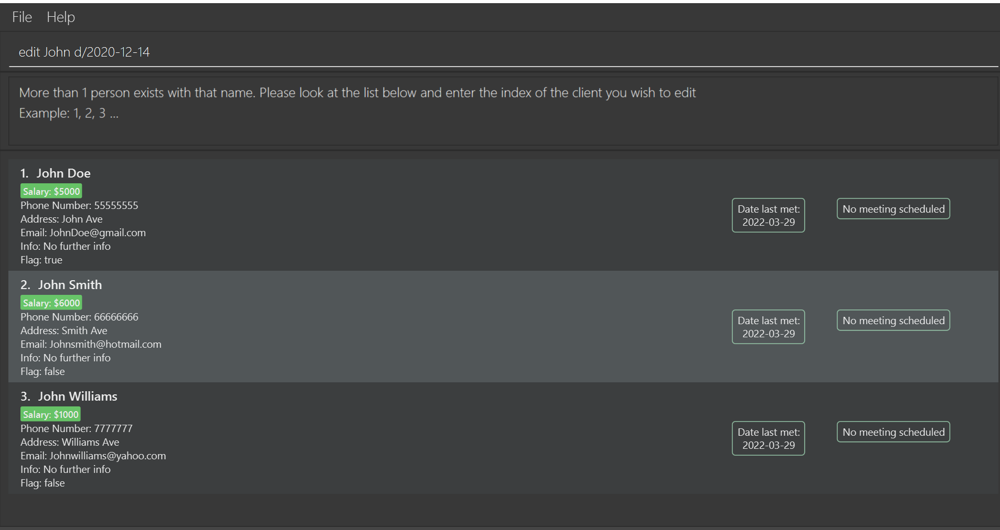
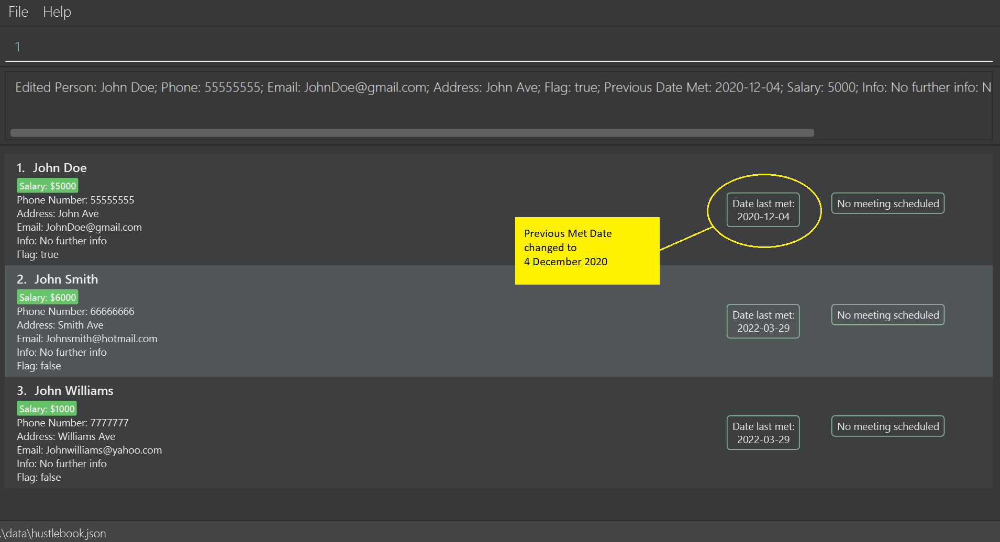

HustleBook (HB) is a desktop app specially catered towards financial advisors for **managing client details and meetings, optimized for use via a Command Line Interface** (CLI) while still having the benefits of a Graphical User Interface (GUI). 
If you can type fast, HB can get your client management meetings done faster than traditional GUI apps.

This guide will help provide you with all the necessary information to set up, run and use the HustleBook to manage your clients.

To get started, click on any of the headers in the table of content to jump to that section to get more information.

* Table of Contents
  * [Quick Start](#quick-start)
  * [Features](#features)
    * [Viewing Help: `help`](#viewing-help--help)
    * [Adding a client : `add`](#adding-a-client--add)
    * [Listing all clients : `list`](#listing-all-clients--list)
    * [Flagging a client : `flag`](#flagging-a-client--flag)
    * [Unflagging a client : `unflag`](#unflagging-a-client--unflag)
    * [Sorting all clients : `sort`](#sorting-all-clients--sort)
    * [Scheduling / Rescheduling a meeting: `meet`](#scheduling--rescheduling-a-meeting-meet)
    * [Canceling a meeting: `meet`](#canceling-a-meeting-meet)
    * [Editing a client : `edit`](#editing-a-client--edit)
    * [Locating clients by name : `find`](#locating-clients-by-name--find)
    * [Deleting a client : `delete`](#deleting-a-client--delete)
    * [Clearing all entries : `clear`](#clearing-all-entries--clear)
    * [Exiting the program : `exit`](#exiting-the-program--exit)
    * [Saving the data](#saving-the-data)
    * [Editing the data file](#editing-the-data-file)
  * [Command Summary](#command-summary)
  

:bulb: **Tip:**
For new users, it is highly recommended starting off from the `Quck Start` section to get HustleBook up and running.

--------------------------------------------------------------------------------------------------------------------

## Quick start

1. Ensure you have Java `11` or above installed in your Computer.

2. Download the latest `hustlebook.jar` from [here](https://github.com/AY2122S2-CS2103T-W15-2/tp/releases/).

3. Copy the file to the folder you want to use as the _home folder_ for your HustleBook.

4. Double-click the file to start the app. The GUI similar to the below should appear in a few seconds. Note how the app contains some sample data. 
   

5. Type the command in the command box and press Enter to execute it. e.g. typing **`help`** and pressing Enter will open the help window. 
   Some example commands you can try:

   * **`list`** : Lists all contacts.

   * **`add`**`n/John Doe p/98765432 e/johnd@example.com a/John street, block 123, #01-01` : Adds a contact named `John Doe` to the HustleBook.

   * **`delete`**`John Doe` : Deletes `John Doe` from the list.

   * **`clear`** : Deletes all contacts.

   * **`exit`** : Exits the app.

6. Refer to the [Features](#features) below for details of each command.

Now that you have set up the HustleBook, lets take a look at what Hustlebook offers to allow you to do the hustle without moving a muscle.

--------------------------------------------------------------------------------------------------------------------

## Features

**:information_source: Notes about the command format:** 

* Words in `UPPER_CASE` are the parameters to be supplied by the user. 
  e.g. in `add n/NAME`, `NAME` is a parameter which can be used as `add n/John Doe`.

* Items in square brackets are optional. 
  e.g `n/NAME [t/TAG]` can be used as `n/John Doe t/friend` or as `n/John Doe`.

* Items with `…`​ after them can be used multiple times including zero times. 
  e.g. `[t/TAG]…​` can be used as ` ` (i.e. 0 times), `t/friend`, `t/friend t/family` etc.

* Parameters can be in any order. 
  e.g. if the command specifies `n/NAME p/PHONE_NUMBER`, `p/PHONE_NUMBER n/NAME` is also acceptable.

* If a parameter is expected only once in the command but you specified it multiple times, only the last occurrence of the parameter will be taken. 
  e.g. if you specify `p/12341234 p/56785678`, only `p/56785678` will be taken.

* Extraneous parameters for commands that do not take in parameters (such as `cleardemo`, `help`, `list`, `exit` and `clear`) will be ignored. 
  e.g. if the command specifies `help 123`, it will be interpreted as `help`.

### Viewing help : `help`

Shows a message explaining how to access the help page.

Format: `help`

### Adding a client : `add`

Adds a client to the HustleBook.

Format: `add n/NAME p/PHONE_NUMBER e/EMAIL a/ADDRESS [s/SALARY] [i/INFO] [d/DATE] [f/FLAG] [t/TAG]…​`

:bulb: **Tip:**
A client's data can be added in the future through edit command

* `d/DATE` will be set to today's date by default if not specified.
  * `DATE` has to be in the format **YYYY-MM-DD**.
* `i/INFO` will be set to `No further info` by default if not specified.
* `t/TAG` will be empty by default if not specified.
* `f/FLAG` will be set to `false` by default if not specified.
* `s/SALARY` will be set to 0 by default if not specified.

Examples:
* `add n/John Doe p/98765432 e/johnd@example.com a/Blk 775 Pasir Ris Street 71 S510775`
* `add n/Betsy Crowe t/friend e/betsycrowe@example.com a/NUS School of Computing, COM1 s/4300 p/1234567 i/Salary of $3400 f/true`

### Listing all clients : `list`

Shows a list of all clients in the HustleBook.

Format: `list`

### Flagging a client : `flag`

Flag a client in the HustleBook to mark them as important. 

Format: `flag NAME`

* `NAME` input should be a name found in the HustleBook.
* `NAME` is not case-sensitive.
* In the event where more than one name is matches `NAME` input, you would need to specify using `INDEX` 
of the list shown.

### Unflagging a client : `unflag`

Unflag a client in the HustleBook to unmark flagged clients.

Format: `unflag NAME`

* `NAME` input should be a name found in the HustleBook.
* `NAME` is not case-sensitive.
* In the event where more than one name is matches `NAME` input, you would need to specify using `INDEX`
  of the list shown.

### Sorting all clients : `sort`

Sorts clients such that flagged clients are displayed before unflagged clients.
It then sorts all clients in HustleBook based on the parameter provided.

Format: `sort PARAMETER`

* `PARAMETER` you can use are: `meeting`,`name`, `prev` and `salary`
* `PARAMTER` is not case-sensitive. 

Example:
* `sort salary`

### Scheduling / Rescheduling a meeting: `meet`

Schedules a meeting with the `NAME` given of the client with the `DATE` and `TIME` specified.
The same command can be used to reschedule a meeting with the client.

Format: `meet NAME d/DATE t/TIME`

* `DATE` input must be in `YYYY-MM-DD` format
* `TIME` input must be in 24-hr format of `HHmm`.
* In the event where more than one name is matches `NAME` input, you would need to specify using `INDEX`
    of the list shown.

### Canceling a meeting: `meet`

Schedules a meeting with the `NAME` given of the client with the `DATE` and `TIME` specified.

Format: `meet NAME c/`

* `c/` will clear the meeting with the `NAME`
  * If `c/WORDS` is input, eg. `meet John Doe c/abcdef`,HustleBook will still clear the meeting with the given `NAME`.
* In the event where more than one name is matches `NAME` input, you would need to specify using `INDEX`
  of the list shown.

### Editing a client : `edit`

Edits an existing client in the HustleBook.

Format: `edit NAME [n/NAME] [p/PHONE] [e/EMAIL] [a/ADDRESS] [s/SALARY] [i/INFO] [d/DATE] [t/TAG]…​`

* Edits the client named `NAME`.
  * `Name` is case-insensitive. E.g. `John` will match `john`.
  * Only full words will be matched e.g. `Han` will not match `Hans`.
  * Spaces in `NAME` will be counted as separate names, unless `NAME` fully matches client's name
    * Example: `edit John Doe p\88888888` will find clients with names containing `John` and `Doe`,
                there exists a client with the name `John Doe`
  * The order of the keywords does not matter. e.g. `Hans Bo` will match `Bo Hans`.
* If `NAME` matches multiple clients, you will see a list of clients with matching names
  * Input the position on the list of the client you wish to edit.

Example:

**Scenario 1**: You have a client named `John Doe`
* `edit n/John Doe d/2020-12-04` Edits the previous meeting date of the client with the name `John Doe` to
  `2020-12-04` which is 4th Dec 2020.
  
**Scenario 2**: You have clients named `John Doe` `John Smith` and `John Willams`
* Running the command `edit n/John d/2020-12-04` will show a list of clients with names containing "John"

* Typing `1` will edit "John Doe", typing `2` will edit "John Smith" and typing `3` will edit "John Williams"
* After typing `1`, the previous meeting date of the client with the name `John Doe` to `2020-12-04`

**:information_source: Notes on `edit`:** 

* `DATE` has to be in the format **YYYY-MM-DD**.
* **At least one** of the optional fields must be provided.
* Existing values will be updated with the input values.
* When editing tags, the existing tags of the client will be removed i.e adding of tags is not cumulative.
* You can remove all the client’s tags by typing `t/` without specifying any tags after it.
* You can remove the client's info by typing `i/` without specifying any info after it.

### Locating clients by name : `find`

Finds clients whose names contain any of the given keywords.

Format: `find KEYWORD [MORE_KEYWORDS]`

* The search is case-insensitive. e.g `hans` will match `Hans`.
* The order of the keywords does not matter. e.g. `Hans Bo` will match `Bo Hans`.
* Only the name is searched.
* Only full words will be matched e.g. `Han` will not match `Hans`.
* Clients matching at least one keyword will be returned (i.e. `OR` search).
  e.g. `Hans Bo` will return `Hans Gruber`, `Bo Yang`

Examples:
* `find John` returns `john` and `John Doe`
* `find alex david` returns `Alex Yeoh`, `David Li` 

  

### Deleting a client : `delete`

Deletes the specified client from the HustleBook.

Format: `delete NAME`

* Deletes the client with the specified `NAME`.
  * `Name` is case-insensitive. e.g. `John` will match `john`.
  * Only full words will be matched e.g. `Han` will not match `Hans`.
  * Spaces in `NAME` will be counted as separate names, unless `NAME` fully matches client's name
    * Example: `edit John Doe p\88888888` will find clients with names containing `John` and `Doe`,
                there exists a client with the name `John Doe`
  * The order of the keywords does not matter. e.g. `Hans Bo` will match `Bo Hans`.
* If `NAME` matches multiple clients, you will see a list of clients with matching names
  * Input the position on the list of the client you wish to edit.
  
Example:
Scenario: You have clients named `John Doe` `John Smith` and `John Willams`
* Running the command `delete n/John` will show a list of clients with names containing "John"
* If you wish to delete `John Doe` and he is the first person listed, typing `1` will delete `John Doe`

### Clearing all entries : `clear`

Clears all entries from the HustleBook.

Format: `clear`

### Exiting the program : `exit`

Exits the program.

Format: `exit`

### Saving the data

HustleBook data are saved in the hard disk automatically after any command that changes the data. There is no need to save manually.

### Editing the data file

HustleBook data are saved as a JSON file `[JAR file location]/data/hustlebook.json`. Advanced users are welcome to update data directly by editing that data file.

:exclamation: **Caution:**
If your changes to the data file makes its format invalid, HustleBook will discard all data and start with an empty data file at the next run.

--------------------------------------------------------------------------------------------------------------------

## Command summary

| Action     | Format, Examples                                                                                                                                                                            |
|------------|---------------------------------------------------------------------------------------------------------------------------------------------------------------------------------------------|
| **Add**    | `add n/NAME p/PHONE_NUMBER e/EMAIL a/ADDRESS [s/SALARY] [d/DATE] [i/INFO] [t/TAG]…​`   e.g., `add n/James Ho p/22224444 e/jamesho@example.com a/123, Clementi Rd, 1234665 d/Salary-3400` |
| **List**   | `list`                                                                                                                                                                                      |
| **Clear**  | `clear`                                                                                                                                                                                     |
| **Sort**   | `sort`                                                                                                                                                                                      |
| **Delete** | `delete NAME`  e.g., `delete John`                                                                                                                                                       |
| **Flag**   | `flag NAME`  e.g., `flag John`                                                                                                                                                           |
| **Unflag** | `unflag NAME`   e.g., `unflag John`                                                                                                                                                      |
| **Meet**   | `meet NAME d/DATE t/TIME`   e.g., `meet John d/2022-05-25 t/1430`                                                                                                                        |
| **Edit**   | `edit NAME [n/NAME] [p/PHONE_NUMBER] [e/EMAIL] [a/ADDRESS] [d/DATE] [i/INFO] [t/TAG]…​`  e.g.,`edit John n/James Lee e/jameslee@example.com`                                             |
| **Find**   | `find KEYWORD [MORE_KEYWORDS]`  e.g., `find James Jake`                                                                                                                                  |
| **Help**   | `help`                                                                                                                                                                                      |
